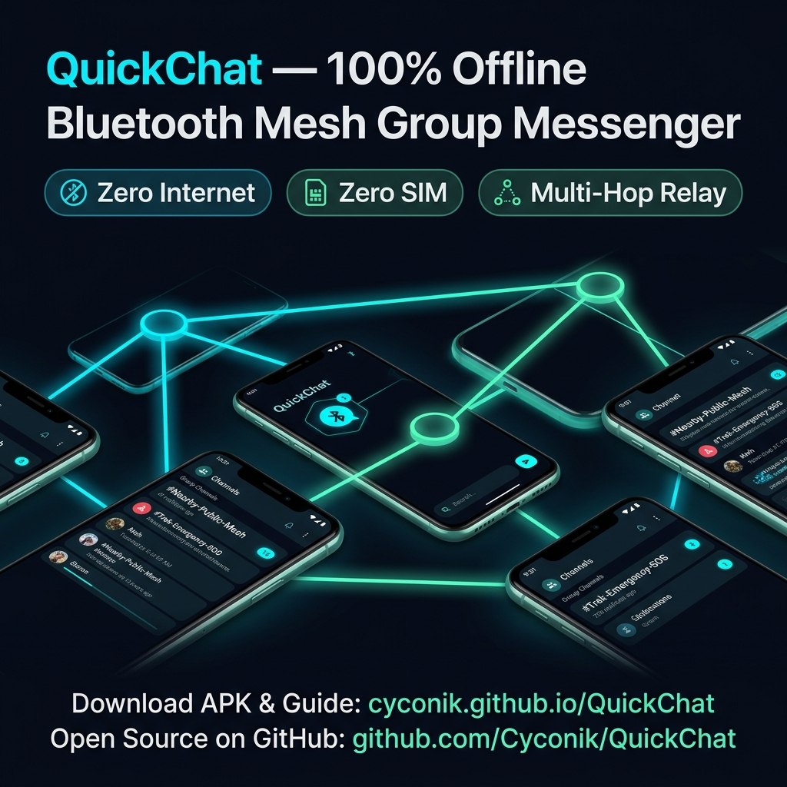
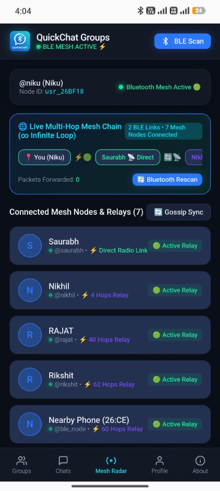
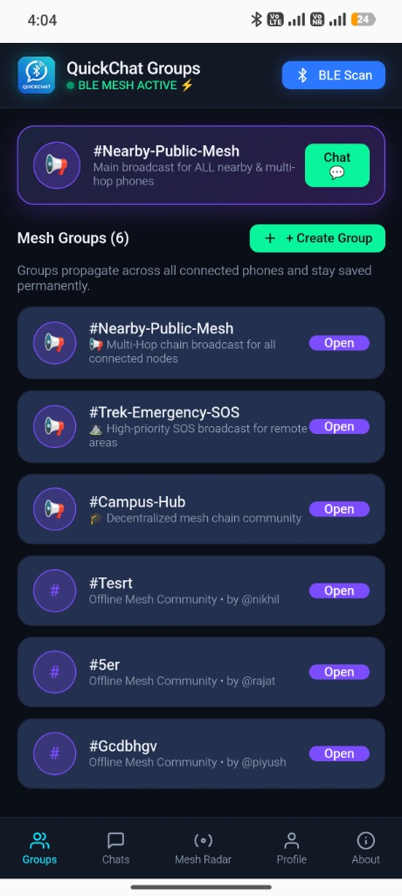
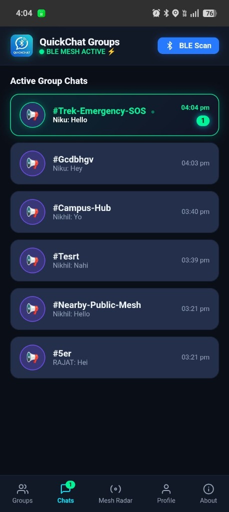
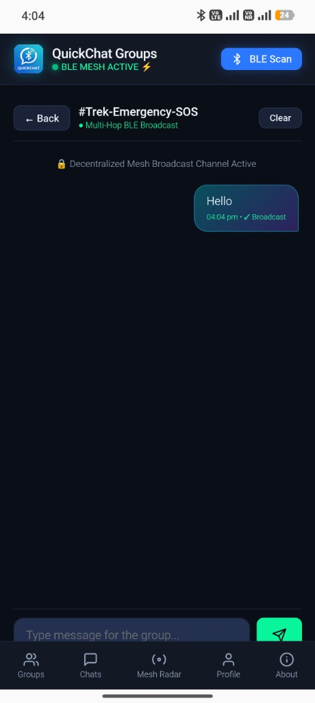
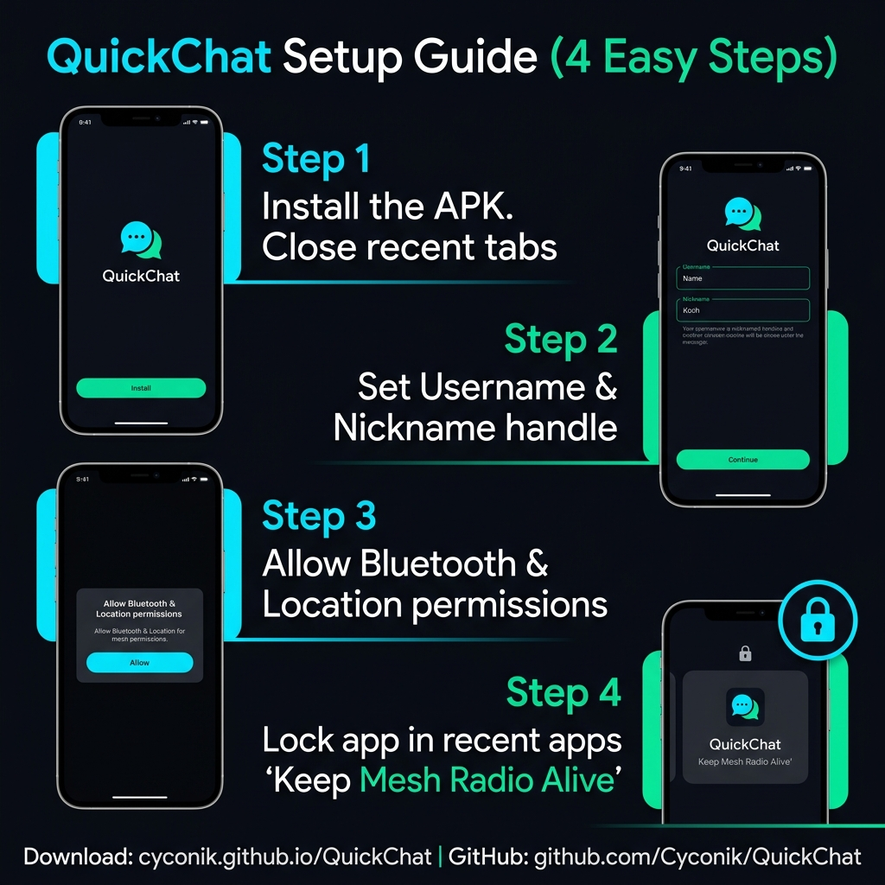

# QuickChat — 100% Offline Bluetooth Mesh Group Messenger

> **"Zero Internet. Zero Cellular Towers. Zero SIM Cards. 100% Decentralized Mesh Groups."**

QuickChat is an open-source, offline decentralized communication platform for Android that connects nearby smartphones into an autonomous **Multi-Hop Bluetooth Low Energy (BLE) Mesh Chain** (`Phone A ➔ Phone B ➔ Phone C ➔ Phone D ➔ ♾️`). All messages broadcast across persistent mesh groups with zero cellular data or Wi-Fi required.
  
📱 **Direct APK Download**: [QuickChat-Mesh-Offline.apk](https://github.com/Cyconik/QuickChat/raw/main/QuickChat-Mesh-Offline.apk)

<p align="center">
  
</p>

---

## 📸 Step-by-Step App Interface Walkthrough

### 1️⃣ Live Mesh Radar & Multi-Hop Relay Nodes
QuickChat turns your phone into an active BLE relay node. You can see real-time connected mesh nodes, signal links, and hop counts across the entire network chain (`1 Hop`, `4 Hops`, `40 Hops`, `60 Hops`).

<p align="center">
  
</p>

---

### 2️⃣ Mesh Groups & Public Broadcast Hub
Join the global **#Nearby-Public-Mesh** channel or create permanent custom groups (e.g. `#Trek-Emergency-SOS`, `#Campus-Hub`). Groups stay saved permanently and propagate automatically to neighboring phones.

<p align="center">
  
</p>

---

### 3️⃣ Active Group Chats & Real-Time Unread Alerts
Incoming messages trigger instant audio chimes 🔔 and haptic vibrations. The active chats screen organizes your conversations with live unread counter badges and last message previews.

<p align="center">
  
</p>

---

### 4️⃣ Real-Time Multi-Hop Group Chat Room
Type and send messages to the group. Messages broadcast over BLE radio and hop through intermediate phones without internet. Creators have Admin controls 👑 to clear chat history across all participating nodes.

<p align="center">
  
</p>

---

## 📱 Installation & Setup Guide (Step-by-Step)

<p align="center">
  
</p>

Follow these 4 essential steps after downloading the APK to ensure continuous background listening:

### 1️⃣ Step 1: Install APK & Close Recent Apps First
- Download and install [QuickChat-Mesh-Offline.apk](https://github.com/Cyconik/QuickChat/raw/main/QuickChat-Mesh-Offline.apk).
- *Important*: Close all existing background apps/tabs before launching QuickChat for the first time.

### 2️⃣ Step 2: Open App & Set Username
- Launch QuickChat.
- Set your Display Name and Username handle (or tap **🎲 Shuffle** to pick a quick 1-tap nickname).
- Tap **Launch QuickChat Mesh 🚀** (No phone number or OTP required).

### 3️⃣ Step 3: Grant Permissions (Bluetooth & Location)
- Allow **Bluetooth / Nearby Devices** and **Location** permissions so Android lets the Native BLE radio scan and broadcast.
- *Troubleshooting*: If permission prompts do not appear, clear QuickChat from Recent Apps and reopen it, or go to **Phone Settings ➔ Apps ➔ QuickChat ➔ Permissions** and manually enable "Nearby Devices" and "Location".

### 4️⃣ Step 4: Lock App in Background (Crucial) 🔒
- To ensure you **never miss any incoming group messages**, keep QuickChat running in the background.
- Open your phone's **Recent Apps** menu, long-press or tap the lock icon / 3 dots on the QuickChat card, and choose **Lock App (🔒)**.
- Set Battery Usage to **"Unrestricted / Don't Optimize"** so Android does not terminate the background Bluetooth mesh radio.

---

## 🏗 Architecture & BLE Packet Chunking

```
[ Phone A ] -------- BLE --------> [ Phone B ] -------- BLE --------> [ Phone C ]
  (Sender)                        (Mesh Relay 1)                     (Mesh Relay 2)
                                                                            |
                                                                           BLE
                                                                            v
[ Group #Nearby-Public-Mesh ] <--- BLE <----------------------------- [ Phone D ]
(All Connected Devices)                                              (Mesh Relay 3)
```

- **Native BLE GATT Server & Client**: Custom Android Plugin (`NativeBleMeshPlugin.java`) operates continuous BLE advertising, background scanning, and bidirectional GATT notifications.
- **Packet Chunking & Reassembly**: Packets are segmented (`QC:seqId:idx:total:data`) and reassembled seamlessly to eliminate MTU size truncation.
- **Deterministic Canonical Group IDs**: Group names map deterministically (`#Mountain-Trek` ➔ `group_mountain_trek`), guaranteeing synchronization across all phones in the network.
- **Gossip Topology Sync**: Heartbeat packets (`PEER_HEARTBEAT`) sync discovered groups and relay routes automatically.

---

## 🛠 Tech Stack

- **Android Client**: Capacitor + Native Java BLE Plugin (`android.bluetooth.le`, GATT Server/Client)
- **Web Frontend**: Vanilla JavaScript, Responsive CSS, Web Audio API, Service Worker PWA
- **Local Storage**: IndexedDB / LocalStorage for offline chat persistence
- **WAN Bridge (Optional)**: MQTT WebSocket client (`broker.emqx.io`) for multi-device internet fallback when connectivity is available

---

## 📄 License

Open source under the [MIT License](LICENSE).
